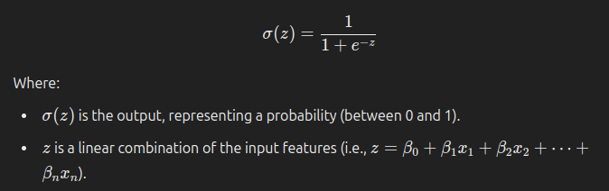
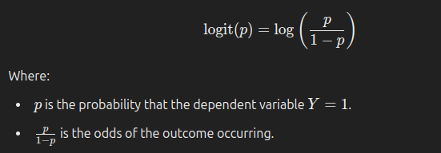

## Supervised Learning

### Classification with logistic regression and support vector machines (SVMs).

**Classification predicts a discrete target label Y. Classification is the problem of assigning new observations to the class to which they most likely belong, based on a classification model built from labeled training data.**

### Logistic Regression
Logistic regression is a method of classification: the model outputs the probability of a categorical target variable Y belonging to a certain class.

### Can I just use ordinary least squares?
No. If you trained a linear regression model on a bunch of examples where Y = 0 or 1, you might end up predicting some probabilities that are less than 0 or greater than 1, which doesn’t make sense.

### Logit model
A logit model, also known as logistic regression, is a statistical model used for predicting a binary outcome (i.e., two possible classes, often labeled as 0 or 1) based on one or more predictor variables. It is widely used in binary classification problems.

#### Key Concepts of a Logit Model:

1. Logistic Function (Sigmoid Function): The logistic model is based on the logistic function (also called the sigmoid function), which maps any real-valued number to a value between 0 and 1. This property makes it suitable for predicting probabilities of class membership.

The logistic function is given by...

2. Logit Transformation: In logistic regression, instead of predicting the output directly as a binary value (0 or 1), the model predicts the log-odds or logit of the probability of the outcome being 1.

The logit function is the inverse of the logistic function and is defined as:

3. Logistic Regression Formula: The logit model assumes a linear relationship between the log-odds and the input features. For n predictors x1, x2, x3, x4 .......xn the logistic regression model is expressed as:

4. Interpretation:

The coefficients 𝛽1,𝛽2,…,𝛽𝑛 represent the impact of each predictor variable on the log-odds of the outcome.

If 𝛽𝑘 > 0 increasing x𝑘 increases the probability of the outcome being 1 (positive relationship).

​
If 𝛽𝑘 < 0 increasing xk decreases the probability of the outcome being 1 (negative relationship).
