## Vector
A vector is a mathematical object that has both magnitude and direction. In the context of linear algebra, a vector is typically represented as a list of numbers arranged in a single row or column.

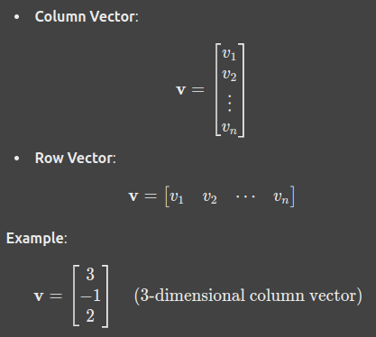

It has either a single row or a single column.

Vector (Column):

[v1]
[v2]
[v3]

### Mathematical Operations on Vectors

1. Addition and Subtraction:
Vectors of the same dimension can be added or subtracted element-wise.

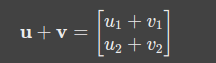

2. Scalar Multiplication:
Each component of the vector is multiplied by a scalar.

3. Dot Product:
Produces a scalar by multiplying corresponding components and summing them.

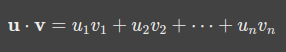

## Matrix
A matrix is a rectangular array of numbers arranged in rows and columns. It can be used to represent linear transformations, systems of linear equations, and more.

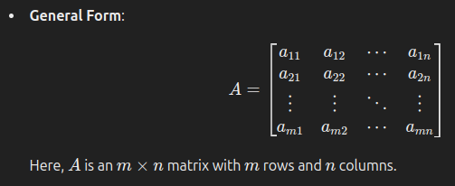

## Matrix Vector Multiplication

A matrix-vector product involves multiplying a matrix by a vector, resulting in a new vector. This operation is fundamental in linear algebra and is commonly used in fields such as computer graphics, physics simulations, and machine learning.

Let A be m x n matrix.

The matrix-vector product Ax is given by:

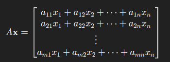

This results in a new vector with m components.

## Vector Vector Multiplication
1. Dot Product (Scalar Product)
The dot product of two vectors produces a scalar (a single number) and is useful in determining the angle between two vectors or the projection of one vector onto another.

Formula:
Given two vectors a and b:

Geomatric Interpretaion:

Properties:

2. Cross Product (Vector Product)
The cross product of two vectors results in a new vector that is perpendicular (orthogonal) to the plane formed by the two original vectors. This is only defined for 3-dimensional vectors.

Geomatric Interpretation:

Key Properties:

3. Triple Product
There are two types of triple products involving vectors, both used in advanced applications.

a. Scalar Triple Product:
The scalar triple product involves three vectors and is calculated by taking the dot product of one vector with the cross product of the other two:

    a.(b x c)

This scalar represents the volume of the parallelepiped formed by the three vectors. If the result is zero, the vectors are coplanar.

b. Vector Triple Product:
The vector triple product involves taking the cross product of a vector with the cross product of two other vectors:

    a x (b x c)

This results in a vector and follows the bac-cab rule:

    a x (b x c) = (a.c)b - (a.b)c

### Vector products

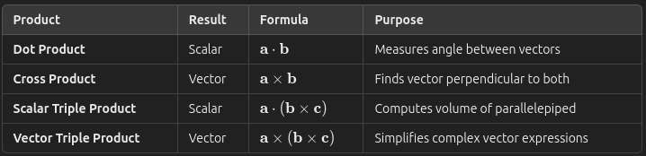

## Inner Products
The inner product (also known as the dot product in some contexts) in the context of matrices is an operation that generalizes the dot product of vectors to higher dimensions. It allows us to compute a scalar from two vectors or matrices.

1. Inner Product of Vectors
The inner product of two vectors is the sum of the products of their corresponding components. This is essentially the same as the dot product of two vectors. If a and b are vectors, their inner product is:

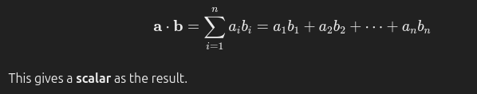

2. Inner Product of Matrices
In the case of matrices, the inner product is a bit more nuanced. The inner product of two matrices is defined as the sum of the products of their corresponding entries, provided the two matrices have the same dimensions. This is essentially a generalization of the dot product to two matrices.

3. Geometric Interpretation
For vectors, the inner product measures the angle and magnitude relationship between two vectors. If the inner product is zero, the vectors are orthogonal (perpendicular to each other). For matrices, the inner product is similar, but it is more abstract—it measures the alignment between two matrices in a higher-dimensional space.

4. Special Case: Frobenius Inner Product
When dealing with matrices, a common inner product is the Frobenius inner product, which is defined exactly as the inner product above. It is essentially the sum of the products of corresponding elements, and it's commonly used in the study of matrix norms and matrix approximations.

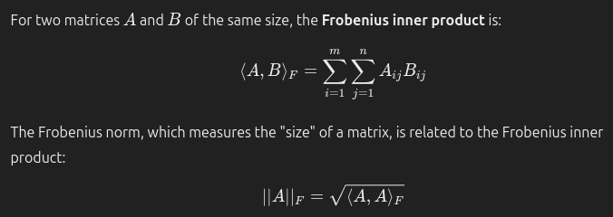

### Norm
A norm is a function that assigns a non-negative length or size to a vector in a vector space. It is a way to measure the "magnitude" or "length" of a vector. Norms are widely used in linear algebra, functional analysis, optimization, and machine learning to quantify the size of vectors and matrices.

Types of Norms

1. Euclidean Norm (L2 Norm)
The Euclidean norm, also called the L2 norm, is the most common way to measure the length of a vector. It is defined as the square root of the sum of the squares of the vector components.

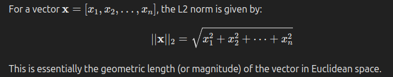

The Euclidean norm gives us the straight-line distance from the origin to the point represented by the vector x.

2. Manhattan Norm (L1 Norm)
The Manhattan norm, also called the L1 norm, is the sum of the absolute values of the vector components. It measures the "taxicab" distance (the distance you would travel along grid-like streets in a city).

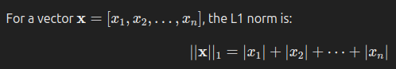

The L1 norm measures the distance traveled by following the grid lines, like in a Manhattan-style city.

3. Infinity Norm (L∞ Norm)
The Infinity norm, or L∞ norm, is the maximum absolute value among the vector's components. It measures the largest magnitude component in the vector.

4. Frobenius Norm (for Matrices)
The Frobenius norm is a way to measure the size of a matrix and is the matrix equivalent of the Euclidean norm. It is defined as the square root of the sum of the squares of all the elements in the matrix.

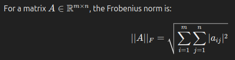