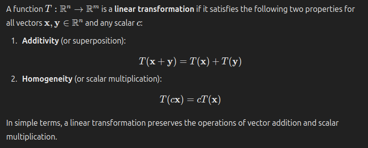
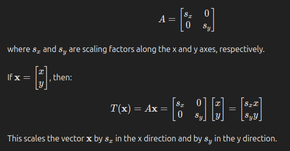
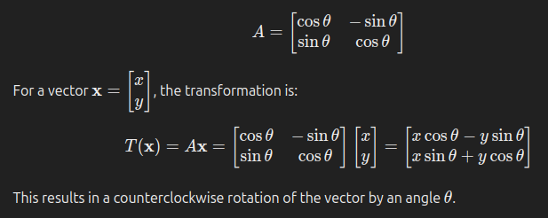
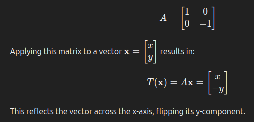
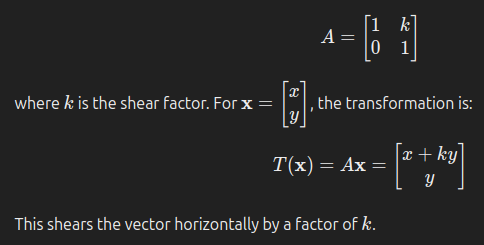
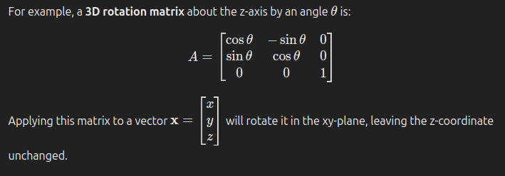

## Matrix linear transformation
**A matrix linear transformation is a function that maps vectors from one space to another using matrix multiplication, preserving the operations of addition and scalar multiplication. Depending on the matrix, it can represent various geometric transformations like rotation, scaling, reflection, and shear.**

A matrix linear transformation refers to a mathematical operation where a matrix is used to map or transform a vector from one space to another, while preserving the properties of linearity.

### Definition of a Linear Transformation

### Matrix Representation of a Linear Transformation

Any linear transformation can be represented by matrix multiplication. If 𝐴 ∈ 𝑅𝑚×𝑛 is a matrix and x ∈ R𝑛 is a vector, the transformation of x by 𝐴 is given by:

    𝑇(x) = 𝐴x

Here, T(x) is the image of x under the linear transformation, and it results in a new vector in 𝑅𝑚.

### Common Types of Linear Transformations
1. Scaling
Scaling stretches or compresses a vector by a constant factor along one or more axes. The matrix for scaling in 2D can be represented as:

2. Rotation
A rotation matrix rotates a vector around the origin by an angle θ. The 2D rotation matrix is

3. Reflection
A reflection matrix reflects a vector about a line. For example, reflecting a vector across the x-axis in 2D is represented by the following matrix:

3. Shear
Shearing transforms a vector such that one coordinate is displaced by an amount proportional to the other coordinate. A 2D shear matrix along the x-axis is:

### Matrix Linear Transformation in 3D
The same principles apply in three dimensions, but the transformation matrices become 3×3 matrices.

### Properties of Matrix Linear Transformations
1. Linearity: As mentioned, matrix transformations preserve vector addition and scalar multiplication. This is why they are called "linear" transformations.

2. Composition: Two linear transformations can be combined by multiplying their corresponding matrices. If T1 is represented by matrix A1, and T2 is represented by matrix A2, then applying T2 followed by T1 corresponds to multiplying the matrices: A1A2.

3. Inverses: If a matrix is invertible (i.e., its determinant is non-zero), the linear transformation has an inverse transformation, which "undoes" the effect of the transformation. The inverse is given by the matrix A−1.

4. Determinants and Volumes: In R2, the determinant of a 2×2 matrix measures how the linear transformation affects the area of shapes. In R3, it measures the change in volume. A determinant of 1 means the transformation preserves area or volume, while a determinant of 0 means the transformation collapses the space to a lower dimension.