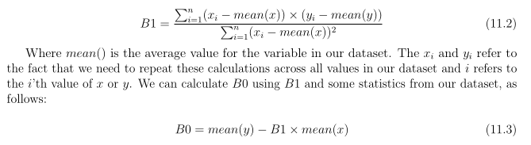
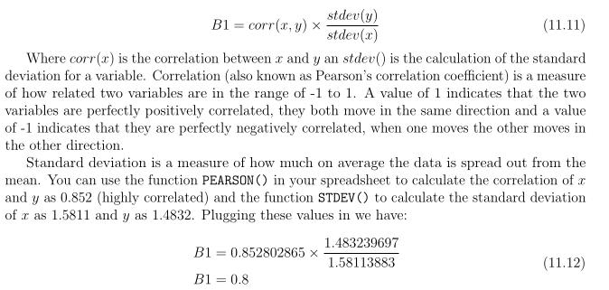

## Linear Regression Model Representation

Linear regression is a linear model, e.g. a model that assumes a linear relationship between the input variables (x) and the single output variable (y). More specifically, that y can be calculated from a linear combination of the input variables (x). 

For example, in a simple regression problem (a single x and a single y), the form of the model would be:

    y = B0 + B1 × x

    B1 - Coefficient of x column
    B0 - Bias coefficient

### Simple Linear regression
When there is a single input variable (x), the method is referred to as simple linear regression.

With simple linear regression when we have a single input, we can use statistics to estimate the coefficients. This requires that you calculate statistical properties from the data such as means, standard deviations, correlations and covariance. All of the data must be available to traverse and calculate statistics.

### Multiple Linear regression
When there are multiple input variables, literature from statistics often refers to the method as multiple linear regression.

### Ordinary Least Squares
When we have more than one input we can use Ordinary Least Squares to estimate the values of the coefficients. The Ordinary Least Squares procedure seeks to minimize the sum of the squared residuals. This means that given a regression line through the data we calculate the distance from each data point to the regression line, square it, and sum all of the squared errors together. This is the quantity that ordinary least squares seeks to minimize.

This approach treats the data as a matrix and uses linear algebra operations to estimate the optimal values for the coefficients. It means that all of the data must be available and you must have enough memory to fit the data and perform matrix operations.

## Gradient Descent
When there are one or more inputs you can use a process of optimizing the values of the coefficients by iteratively minimizing the error of the model on your training data. This operation is called Gradient Descent and works by starting with zero values for each coefficient.

The sum of the squared errors are calculated for each pair of input and output values. A learning rate is used as a scale factor and the coefficients are updated in the direction towards minimizing the error. The process is repeated until a minimum sum squared error is achieved or no further improvement is possible.

When using this method, you must select a learning rate (alpha) parameter that determines the size of the improvement step to take on each iteration of the procedure. Gradient descent is often taught using a linear regression model because it is relatively straightforward to understand.

### Regularized Linear Regression
There are extensions of the training of the linear model called regularization methods. These seek to both minimize the sum of the squared error of the model on the training data (using Ordinary Least Squares) but also to reduce the complexity of the model (like the number or absolute size of the sum of all coefficients in the model). 

Two popular examples of regularization procedures for linear regression are:
ˆLasso Regression: where Ordinary Least Squares is modified to also minimize the absolute sum of the coefficients (called L1 regularization).

Ridge Regression: where Ordinary Least Squares is modified to also minimize the squared absolute sum of the coefficients (called L2 regularization).

These methods are effective to use when there is collinearity in your input values and ordinary least squares would overfit the training data.

### Making Predictions with Linear Regression
Imagine we are predicting weight (y) from height (x). Our linear regression model representation for this problem would be:

    weight = B0 + B1 x height

Where B0 is the bias coefficient and B1 is the coefficient for the height column. We use a learning technique to find a good set of coefficient values. Once found, we can plug in different height values to predict the weight. 

For example, let’s use B0 = 0.1 and B1 = 0.5. 

Let’s plug them in and calculate the weight (in kilograms) for a person with the height of 182 centimeters.

    weight = 0.1 + 0.05 × 182
    weight = 91.1

You can see that the above equation could be plotted as a line in two-dimensions. The B0 is our starting point regardless of what height we have. We can run through a bunch of heights from 100 to 250 centimeters and plug them to the equation and get weight values, creating our line.

### RUles of thumb when Preparing Data For Linear Regression
when using Ordinary Least Squares Regression

Linear Assumption. Linear regression assumes that the relationship between your input and output is linear. It does not support anything else.This may be obvious, but it is good to remember when you have a lot of attributes. You may need to transform data to make the relationship linear (e.g. log transform for an exponential relationship).
ˆ

Remove Noise. Linear regression assumes that your input and output variables are not noisy. Consider using data cleaning operations that let you better expose and clarify the signal in your data. This is most important for the output variable and you want to remove outliers in the output variable (y) if possible.

ˆ 
Remove Collinearity. Linear regression will over-fit your data when you have highly correlated input variables. Consider calculating pairwise correlations for your input data and removing the most correlated.

ˆ 
Gaussian Distributions. Linear regression will make more reliable predictions if your input and output variables have a Gaussian distribution. You may get some benefit using transforms (e.g. log or BoxCox) on you variables to make their distribution more Gaussian looking.

ˆ
Rescale Inputs: Linear regression will often make more reliable predictions if you rescale input variables using standardization or normalization.

## Simple Linear Regression Tutorial

### Simple Linear Regression 
Let's take an following example to model our data.

    y = B0 + B1 × x

    Where, B0 is bias (in machine learning) or intercept and B1 is slope because it defines the slope of the line or how x
translates into a y value before we add our bias

To find the best estimates for the coefficients to minimize the errors in predicting y from x.

B0 :- Bias 
B1 :- Coefficent

The mean :

### Making Predictions
B0 :- Bias 
B1 :- Coefficent

Let's start predicting y based on model,

    y = B0 + B1 x X

### Estimating Error

p is the predicted value (Put B0, B1 and X values in given model equation, we should get predicted values) and y is the actual value, i is the index for a specific instance, because we must calculate the error across all predicted values.

### Shortcut to evaluate B1 

## Linear Regression using Gradient Descent
***Using Stochastic Gradient Descent to learn the coefficients for a simple linear regression model by minimizing the error on a training dataset.***

### Stochastic Gradient Descent
Gradient Descent is the process of minimizing a function by following the gradients of the cost function. This involves knowing the form of the cost as well as the derivative so that from a given point you know the gradient and can move in that direction, e.g. downhill towards the minimum value.

The way this optimization algorithm works is that each training instance is shown to the model one at a time. The model makes a prediction for a training instance, the error is calculated and the model is updated in order to reduce the error for the next prediction. This procedure can be used to find the set of coefficients in a model that result in the smallest error for the model on the training data. Each iteration the coefficients, called weights (w) in machine learning language are updated using the equation:
    
    w = w − alpha × delta

Where w is the coefficient or weight being optimized, alpha is a learning rate that you must configure and gradient is the error for the model on the training data attributed to the weight.

### Simple Linear Regression with Stochastic Gradient Descent
The coefficients used in simple linear regression can be found using stochastic gradient descent. Stochastic gradient descent is not used to calculate the coefficients for linear regression in practice unless the dataset prevents traditional Ordinary Least Squares being used (e.g. a very large dataset). Nevertheless, linear regression does provide a useful exercise for practicing stochastic gradient descent which is an important algorithm used for minimizing cost functions
by machine learning algorithms. 

As stated in the previous chapter, our linear regression model is defined as follows:

    y = B0 + B1 × x

#### Gradient Descent Iteration #1

Let’s start with values of 0.0 for both coefficients.

    B0 = 0.0
    B1 = 0.0
    y = 0.0 + 0.0 × x

    error = p(i) − y(i)

Where p(i) is the prediction for the i’th instance in our dataset and y(i) is the i’th output variable for the instance in the dataset.

We can now calculate he predicted value for y using our starting point coefficients for the first training instance: 
x = 1, y = 1.

    p(i) = 0.0 + 0.0 × 1
    p(i) = 0

Using the predicted output, we can calculate our error:
    error = (0 − 1)
    error = −1