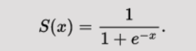
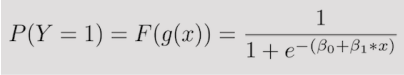

## Supervised Learning

**Classification predicts a discrete target label Y. Classification is the problem of assigning new observations to the class to which they most likely belong, based on a classification model built from labeled training data.**

### Classification with logistic regression and support vector machines (SVMs).

### Logistic Regression
Logistic regression is a method of classification: the model outputs the probability of a categorical target variable Y belonging to a certain class.

### Support Vector Machine

### Can I just use ordinary least squares?
No. If you trained a linear regression model on a bunch of examples where Y = 0 or 1, you might end up predicting some probabilities that are less than 0 or greater than 1, which doesn’t make sense.

### Logit model
**The logit model is a modification of linear regression that makes sure to output a probability between 0 and 1 by applying the sigmoid function**
    
This function is known as sigmoid function which squashes values in between 0 and 1.

A logit model, also known as logistic regression, is a statistical model used for predicting a binary outcome (i.e., two possible classes, often labeled as 0 or 1) based on one or more predictor variables. It is widely used in binary classification problems.

Let's say we've a simple regression model which looks like this...
    
    g(x) = 𝛽0 + 𝛽1 * x + e

To get model output less than 1 and greater than 0, we're going to define a new function called...
F(g(x)) that transforms g(x) by squashing the output of linear regression to a value in the [0,1] range.

We'll plug g(x) in above mentioned sigmoid function resulting in a function of our original function that outputs a probability between 0 and 1:

In other words, we’re calculating the probability that the training example belongs to a certain class: 
P(Y=1).

Here we’ve isolated p, the probability that Y=1, on the left side of the equation. 

If we want to solve for a nice clean β0 + β1x + ϵ on the right side so we can straightforwardly interpret the beta coefficients we’re going to learn, we’d instead end up with the log-odds ratio, or logit, on the left side — hence the name “logit model”:

The log-odds ratio is simply the natural log of the odds ratio, p/(1-p)

β1 now represents the rate of change in the log-odds ratio as X changes.

#### Key Concepts of a Logit Model:

1. Logistic Function (Sigmoid Function): The logistic model is based on the logistic function (also called the sigmoid function), which maps any real-valued number to a value between 0 and 1. This property makes it suitable for predicting probabilities of class membership.

The logistic function is given by...

2. Logit Transformation: In logistic regression, instead of predicting the output directly as a binary value (0 or 1), the model predicts the log-odds or logit of the probability of the outcome being 1.

The logit function is the inverse of the logistic function and is defined as:

3. Logistic Regression Formula: The logit model assumes a linear relationship between the log-odds and the input features. For n predictors x1, x2, x3, x4 .......xn the logistic regression model is expressed as:

4. Interpretation:

    The coefficients 𝛽1,𝛽2,…,𝛽𝑛 represent the impact of each predictor variable on the log-odds of the outcome.

    If 𝛽𝑘 > 0 increasing x𝑘 increases the probability of the outcome being 1 (positive relationship).

    If 𝛽𝑘 < 0 increasing xk decreases the probability of the outcome being 1 (negative relationship).

### Minimizing loss with logistic regression
**In logistic regression, the cost function is basically a measure of how often you predicted 1 when the true answer was 0, or vice versa.**

The first chunk is the data loss, i.e. how much discrepancy there is between the model’s predictions and reality. 

The second chunk is the regularization loss, i.e. how much we penalize the model for having large parameters that heavily weight certain features (remember, this prevents overfitting).

### Support Vector Machines (SVMs)
It typically solves the same problem as logistic regression — classification with two classes — and yields similar performance.

A few examples of the problems SVMs can solve:
    • Is this an image of a cat or a dog?
    • Is this review positive or negative?
    • Are the dots in the 2D plane red or blue?

**This algorithm is geomatrically motivated in nature rather than being driven by probabilistic thinking.**

### Non-parametric models: 

k-nearest neighbors, decision trees, and random forests. Introducing cross-validation, hyperparameter tuning, and ensemble models.